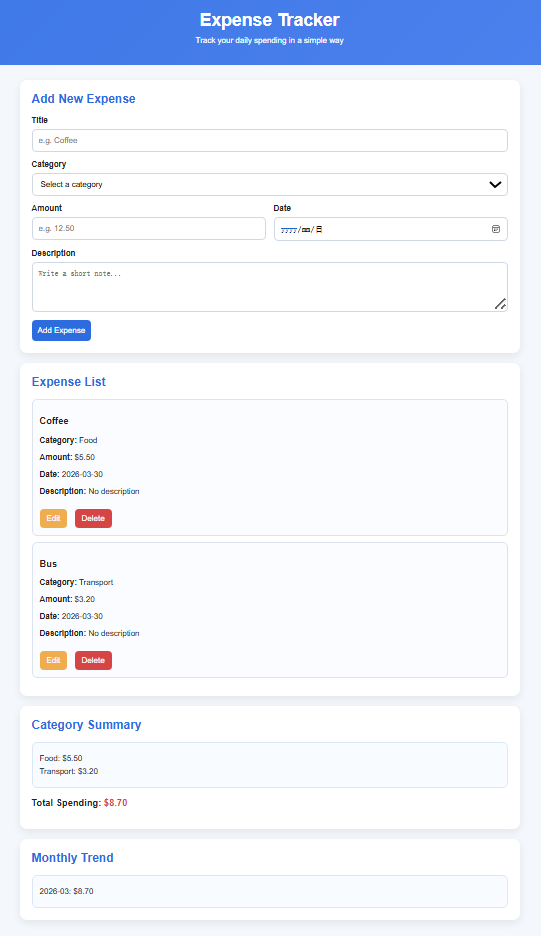
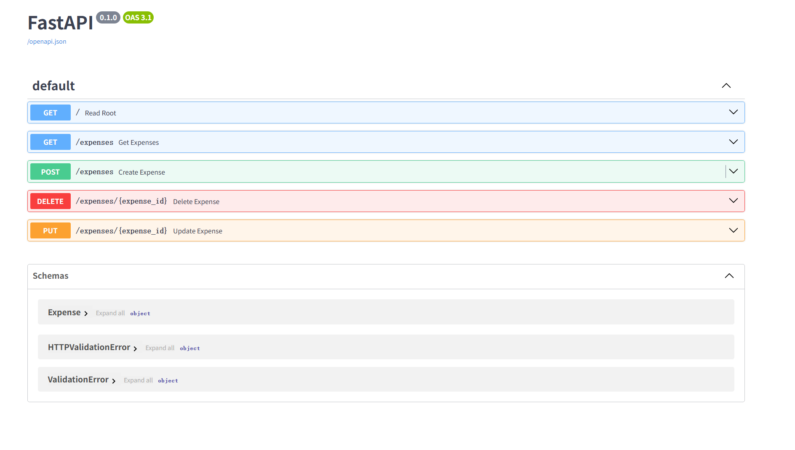
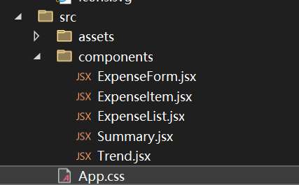
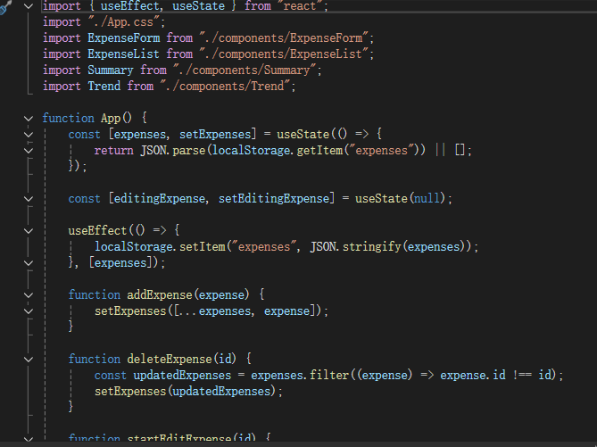

# Expense Tracker

A full-stack expense tracking project built with **React, FastAPI, and MySQL**.  
This project was developed as an individual **Internet Programming** assignment and demonstrates a single-page CRUD application with filtering, summaries, and trend visualisation.

This package keeps the **existing UI unchanged** and improves the project structure and setup process so it is easier to clone to a new computer and run again.

---

## 1. Project Overview

Many people record daily expenses in notes apps, paper notebooks, or simple calculator tools. Those methods can be inconvenient because they do not support structured categories, quick editing, trend analysis, or persistent database storage.

This project solves that problem by allowing users to:

- add expenses in one place
- organise records by category
- edit or delete incorrect entries
- search and filter expense data
- view summaries and spending trends
- store records in a real MySQL database

---

## 2. Main Features

- Single-page application behaviour using React
- Add a new expense record
- View all expense records from the database
- Edit an existing expense
- Delete an expense
- Search by title or description
- Filter by category
- Filter by date range
- Category summary display
- Monthly and daily trend visualisation
- Interactive chart drill-down
- MySQL database persistence

---

## 3. Tech Stack

### Frontend
- React
- JavaScript
- CSS
- Vite
- Chart.js / react-chartjs-2

### Backend
- FastAPI
- Python
- SQLModel
- PyMySQL

### Database
- MySQL

### Development Tools
- VS Code
- MySQL Workbench

---

## 4. Why This Project Qualifies as an SPA

This website behaves like a **Single-Page Application (SPA)** because the user mainly works inside one main interface, and the content updates dynamically without loading a new HTML page.

Actions such as add, edit, delete, search, filter, and chart interaction all happen inside the same interface. This matches the assignment requirement that the app should dynamically rewrite the current page instead of constantly loading new pages from the server.

---

## 5. CRUD Mapping

| Operation | Implementation |
|---|---|
| Create | Add a new expense |
| Read | Load and display all expenses from MySQL |
| Update | Edit an existing expense and save changes |
| Delete | Remove an expense from the database |

This project covers **all CRUD operations** on a real database.

---

## 6. Project Structure

```text
expense-tracker/
├── expense-tracker-backend/
│   ├── db.py
│   ├── main.py
│   ├── models.py
│   ├── requirements.txt
│   ├── setup_database.sql
│   └── .env.example
├── expense-tracker-react/
│   ├── src/
│   │   ├── components/
│   │   │   ├── ExpenseForm.jsx
│   │   │   ├── ExpenseItem.jsx
│   │   │   ├── ExpenseList.jsx
│   │   │   ├── Summary.jsx
│   │   │   └── Trend.jsx
│   │   ├── App.jsx
│   │   ├── App.css
│   │   └── main.jsx
│   ├── public/
│   ├── package.json
│   └── package-lock.json
├── setup_project.bat
├── start_app.bat
├── start_backend.bat
├── start_frontend.bat
└── README.md
```

---

## 7. Project Screenshots and Development Evidence

This section can be used to show both the final interface and the development process.  
You can place your images in `docs/images/` and replace the file names below with your own screenshots.

### Figure 1. Final website interface overview
This screenshot should show the complete expense tracker interface, including the input form, expense list, summary section, and trend area. It helps demonstrate that the project works as a single-page application with the main workflow visible on one screen.



### Figure 2. Expense list and category summary
This screenshot can focus on how expense records are displayed after being added to the database. It should highlight the list layout, category organisation, and summary information so the reader can clearly see the read and filter functions.


### Figure 3. Monthly trend chart
This screenshot should show the trend visualisation area. It can be used to explain how the project supports spending analysis rather than only basic CRUD, which makes the application more practical for users.


### Figure 4. FastAPI CRUD endpoint documentation
This screenshot should show the FastAPI auto-generated API documentation page. It provides evidence that the backend supports the main endpoints used in the project, such as `GET /expenses`, `POST /expenses`, `PUT /expenses/{expense_id}`, and `DELETE /expenses/{expense_id}`.



### Figure 5. React component structure
This screenshot can show the frontend folder or component structure. It helps explain that the interface was broken into reusable parts such as `ExpenseForm`, `ExpenseList`, `ExpenseItem`, `Summary`, and `Trend`.



### Figure 6. App state management logic
This screenshot can show part of the React code used to manage expense data and interface updates. For example, the current state logic using `useState`, `useEffect`, and expense-handling functions is useful evidence of how the page updates dynamically without changing pages.



### Figure 7. Edit or delete feature implementation
This screenshot can show the code or UI state for edit and delete behaviour. It helps demonstrate that the project includes full CRUD functionality rather than only adding and reading data.


### Figure 8. Early prototype or development version
This screenshot can show an earlier version of the interface or development stage. Including one process screenshot is helpful because it shows how the project improved over time instead of appearing only as a final result.


> Tip: if you do not have all eight screenshots yet, you can keep the structure and replace only the figures you currently have. This still makes the README look more complete and easier to read.

---

## 8. How the System Works

### Frontend Flow
1. The user enters expense information in the form.
2. React validates the input fields.
3. The frontend sends requests to the FastAPI backend.
4. The backend performs CRUD operations on MySQL.
5. The page updates dynamically after the latest data is returned.

### Backend Flow
- FastAPI defines the API endpoints.
- SQLModel maps Python classes to the MySQL table.
- MySQL stores records persistently.

### Data Visualisation Flow
- Expense data is grouped by month and by day.
- Monthly charts help users identify larger spending periods.
- Daily drill-down interaction helps users inspect detailed spending on selected dates.

---

## 9. Package Notes

This version keeps the UI unchanged and mainly improves the project setup for cloning and running on a new computer.

### Included setup improvements
- `requirements.txt` for backend dependency installation
- `setup_project.bat` for first-time setup
- `start_app.bat`, `start_backend.bat`, and `start_frontend.bat`
- `setup_database.sql`
- cleaned delivery structure
- support for rebuilding `.venv` and `node_modules` on a new machine

### Network fallback behaviour
The setup script ignores broken local pip mirror settings and tries multiple package sources for Python and npm. This helps when one mirror is unavailable.

---

## 10. First-Time Setup on a New Computer

### A. Required Software
Install these first:

- Python
- Node.js
- MySQL Server
- MySQL Workbench

### B. Create the Database
Open MySQL Workbench or MySQL command line and run:

```sql
CREATE DATABASE expense_tracker;
```

You can also use:

```text
expense-tracker-backend/setup_database.sql
```

### C. Run Setup
Double-click:

```text
setup_project.bat
```

This will:

- create `.venv` in the backend
- install Python packages from `requirements.txt`
- install frontend packages with `npm install`

### D. Start the App
Double-click:

```text
start_app.bat
```

It should open two terminal windows:

- backend: `http://127.0.0.1:8000`
- frontend: `http://localhost:5173`

> If Vite uses another port such as `5174`, check the terminal output and open that local address instead.

---

## 11. Manual Commands

### Backend
```bat
cd expense-tracker-backend
python -m venv .venv
.venv\Scripts\python.exe -m pip install -r requirements.txt --index-url https://pypi.org/simple
.venv\Scripts\python.exe -m uvicorn main:app --reload
```

### Frontend
```bat
cd expense-tracker-react
npm install --registry=https://registry.npmjs.org/
npm run dev
```

---

## 12. Database Configuration

The backend uses MySQL connection settings from `expense-tracker-backend/db.py`.

Default values in this package are:

- host: `localhost`
- port: `3306`
- user: `root`
- database: `expense_tracker`

You may need to update the password or full database URL to match your own MySQL setup.

Supported environment variables include:

- `DATABASE_URL`
- `MYSQL_HOST`
- `MYSQL_PORT`
- `MYSQL_USER`
- `MYSQL_PASSWORD`
- `MYSQL_DATABASE`

---

## 13. Challenges Overcome

- Moving from an early frontend-only prototype to a full-stack structure with React, FastAPI, and MySQL
- Implementing edit logic so updated records replace the original data correctly
- Fixing delete and form-handling issues during development
- Handling environment setup across different computers
- Solving local development issues such as dependency installation, package mirrors, and CORS configuration
- Improving the chart section for clearer trend analysis and drill-down interaction

---

## 14. Future Improvements

- Add user accounts and login
- Add export to CSV
- Add budget limit alerts
- Add dark mode
- Add more advanced charts
- Deploy frontend and backend online for easier access

---

## 15. Author

Developed as an individual assignment for **Internet Programming**.
